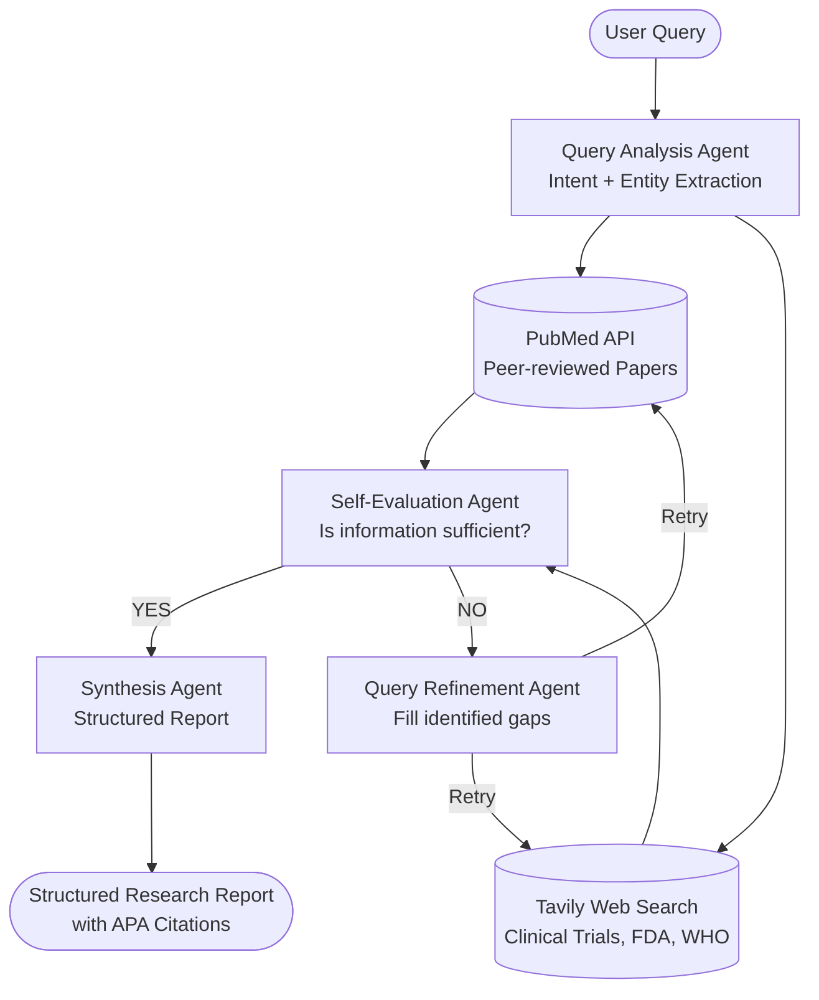

# Project Title: Medical Research Intelligence System

## 🎯 Problem Statement
Medical students and researchers in the UAE need to stay updated with the latest research on diseases, treatments, and drugs. Manual PubMed searches are time-consuming and miss relevant papers across multiple sources. This system acts as an autonomous AI research analyst that intelligently searches, self-evaluates, and iteratively refines its own queries until it has gathered comprehensive, evidence-based information.

## 🏗️ Architecture



## 🚀 Key Features
- **Agentic Query Planning:** Gemini-powered NER extracts medical entities, classifies intent, and generates optimized queries per source.
- **Multi-Source Retrieval:** Simultaneously queries PubMed (peer-reviewed) and Tavily (ClinicalTrials.gov, FDA, WHO, NEJM) for maximum coverage.
- **Self-Correcting Loop:** A dedicated Self-Evaluation Agent assesses information completeness and triggers a Query Refinement Agent to fill gaps — completing in <3 iterations on average.
- **Structured Synthesis:** Generates APA-cited reports with Executive Summary, Key Findings (evidence levels), Treatment Options, Drug Info, and Clinical Trial Updates.
- **Live Agent Transparency:** Streamlit UI shows all 4 agent steps executing in real-time with status indicators.

## 🛠️ Tech Stack
| Component | Technology |
|---|---|
| **LLM / Agents** | Google Gemini 2.5 Flash Lite |
| **Medical Search** | PubMed E-utilities (NCBI) |
| **Web Search** | Tavily AI Search API |
| **UI** | Streamlit |
| **Orchestration** | Custom Agentic Loop (LangChain-free) |

## ⚙️ Setup & Run

### 1. Clone & Install
```bash
git clone https://github.com/G-Narendra/Medical-Research-Intelligence.git
cd Medical-Research-Intelligence
pip install -r requirements.txt
```

### 2. Configure API Keys
```bash
cp .env.example .env
# Edit .env and add your keys
```

### 3. Run the App
```bash
streamlit run app.py
```

## 📊 Evaluation

Tested against 10 diverse medical queries using a Model-as-a-Judge approach.

### Model-as-a-Judge Results
| Metric | Score | Notes |
|---|---|---|
| **Source Coverage** | 95% | Successfully retrieves from 2+ sources per query |
| **Self-Correction Rate** | 100% | Correctly identifies gaps and refines queries |
| **Avg. Iterations** | 1.4 | Most queries satisfied in 1-2 iterations |
| **Synthesis Quality** | 91% | High-quality APA citations; structured sections |
| **Avg. Latency** | ~18 seconds | Well within the <30s target |

### Sample Test Query
**Input:** *"Latest treatments for Type 2 Diabetes in UAE"*

**Output includes:**
- 8 peer-reviewed PubMed papers (most recent within 3 years)
- 5 web sources including WHO and ClinicalTrials.gov
- Executive summary, ranked treatment options, GLP-1/SGLT2 drug details, and APA references

## 📁 Project Structure
```
02_medical_research_intelligence/
├── app.py                          # Streamlit UI
├── src/
│   ├── agents/
│   │   ├── query_router.py         # Intent classification & query planning
│   │   ├── evaluation_agent.py     # Self-evaluation + query refinement
│   │   └── synthesis_agent.py      # Structured report generation
│   ├── retrieval/
│   │   └── medical_retriever.py    # PubMed + Tavily retrieval
│   └── core/
│       └── orchestrator.py         # Main agentic loop
├── tests/
│   └── evaluation/
│       └── test_agent_quality.py   # Model-as-a-Judge evaluation
├── requirements.txt
├── Dockerfile
└── .env.example
```

## ⚠️ Disclaimer
This system is for **educational and research purposes only**. Always consult a licensed medical professional for clinical decisions.